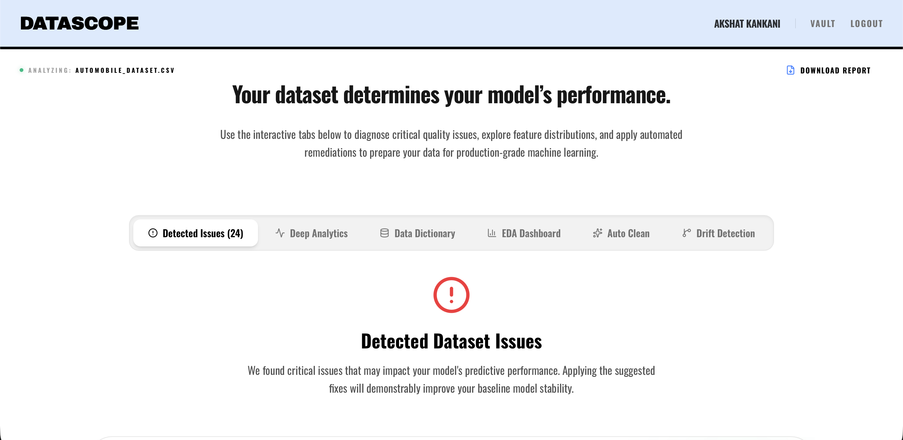

# DataScope Client



The high-fidelity, interactive frontend for the DataScope ML Platform. Built with Next.js and styled with a striking Brutalist aesthetic, this application provides users with an intuitive, drag-and-drop interface for deep dataset analysis, automated data cleaning, and concept drift detection.

<div align="center">

[Features](#features) • [Design System](#design-system) • [Architecture](#architecture) • [Getting Started](#getting-started) • [Deployment](#deployment)

</div>

---

## Key Features

- **Deep Analytics Dashboard** — Interactive visualizations for Exploratory Data Analysis (EDA), including descriptive legends for correlation maps and clear feature importance charts.
- **Secure Vault History** — A dedicated Vault page to track historical analyses, featuring secure search deletion with complete database cascading and clean, dropdown-based Shadcn UI category filtering.
- **Educational Glossary System** — Automatically detects technical ML terms in analytical reports and provides hover-based tooltips with direct links to external resources (e.g., GeeksforGeeks) for actionable guidance.
- **Seamless PDF Exports** — One-click PDF report generation engineered with print-specific CSS to automatically hide navigation and UI elements during export, ensuring clean professional documents.
- **Mandatory Authentication Gate** — Compulsory login/signup interface ensuring secure, user-specific data tracking.
- **Unified File-Upload Zones** — Consistent, intuitive drop-zones spanning across the Auto-Clean, Drift, and Core Analysis modules.

## Design System

The application utilizes a custom **Neobrutalist Design Aesthetic** engineered for high impact and extreme readability:
- **Sharp Industrial UI**: Strict "no-rounded-corners" philosophy combined with high-contrast borders and a dynamic animated dot background.
- **Physical Depth**: "Pop-out" physical shadow effects and brand-aligned blue corner-flap accents on authentication and analysis cards.
- **Minimalist Analytical Components**: Removed extraneous background tints to align all graphs, charts, and tables to a sharp, high-contrast visual hierarchy.

## Architecture

DataScope Client is built for speed, type-safety, and seamless API integration.

- **Framework**: [Next.js](https://nextjs.org/) (App Router)
- **Styling**: TailwindCSS
- **UI Architecture**: [Shadcn UI](https://ui.shadcn.com/)
- **Database / ORM**: Prisma ORM (for Vault history and user authentication)
- **Backend Integration**: Communicates completely seamlessly with the Python FastAPI Intelligence Engine hosted on HuggingFace Spaces.

## Project Structure

```text
├── app/                  # Next.js App Router pages and layouts
├── lib/                  # Utility functions and API connection handlers
├── prisma/               # Database schema and migrations for the Vault
├── public/               # Static assets
└── hero.png              # README banner image
```

## Getting Started

### Prerequisites
- Node.js 18+
- A running instance of the [DataScope Backend](https://github.com/kankaniakshat185/datascope-hf-backend) (or use the live HuggingFace API).

### Local Setup

```bash
# Clone the repository
git clone https://github.com/kankaniakshat185/datascope-app-frontend.git
cd data-debugger-frontend

# Install dependencies
npm install

# Generate Prisma Client for Vault Database
npx prisma generate

# Run the development server
npm run dev
```

Open [http://localhost:3000](http://localhost:3000) to view the application in your browser.

## Deployment

The frontend is optimized for zero-configuration deployment on **Vercel**. 

1. Push your code to GitHub.
2. Import the project into Vercel.
3. Add your `DATABASE_URL` (for Prisma) and your HuggingFace backend URL to the Vercel Environment Variables.
4. Deploy!

## License

MIT
